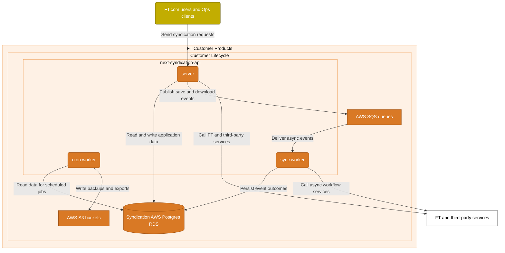
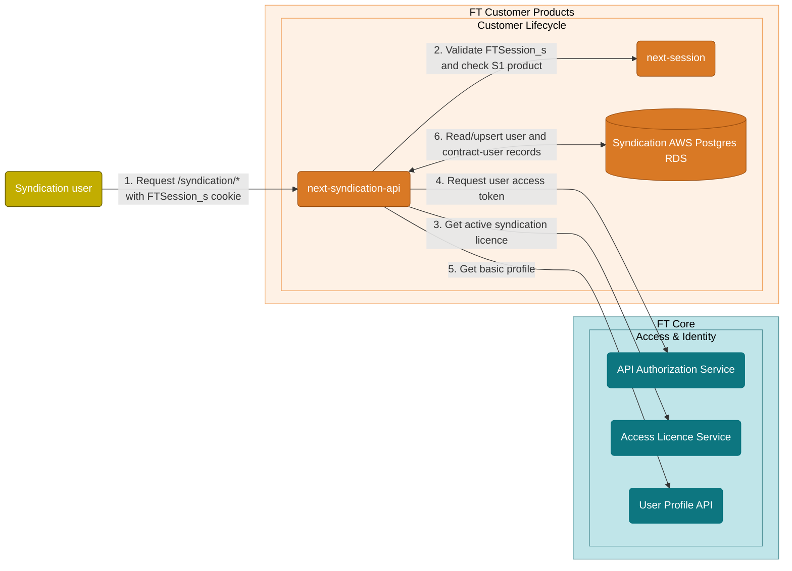
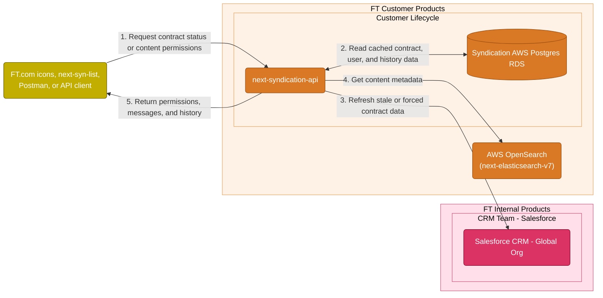
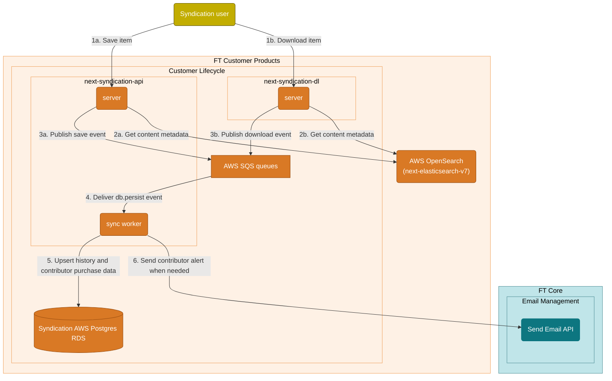
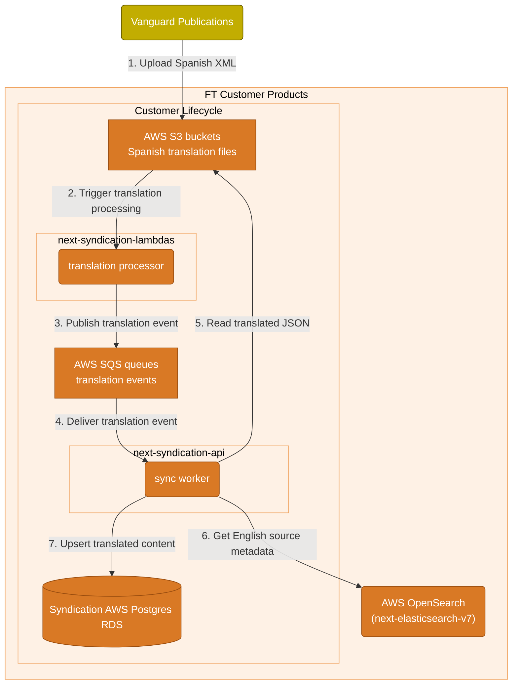
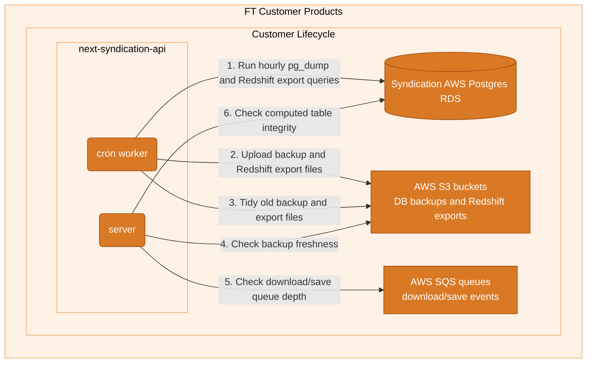

<!--
    Written in the format prescribed by https://github.com/Financial-Times/runbook.md.
    Any future edits should abide by this format.
-->

# Syndication Api

API for FT syndication features

## Code

next-syndication-api

## Primary URL

https://next-syndication-api.eu-west-1.syndication-prod.ftweb.tech/

## Service Tier

Bronze

## Lifecycle Stage

Production

## Contains Personal Data

Yes

## Contains Sensitive Data

No

<!-- Placeholder - remove HTML comment markers to activate
## Can Download Personal Data
Choose Yes or No

...or delete this placeholder if not applicable to this system
-->

<!-- Placeholder - remove HTML comment markers to activate
## Can Contact Individuals
Choose Yes or No

...or delete this placeholder if not applicable to this system
-->

## Host Platform

AWS ECS

## Architecture

**⚠️ Disclaimer:** The following diagrams and descriptions have been generated by Codex.

These diagrams split Syndication into the main workflows the service owns.

### Runtime shape



**next-syndication-api** runs **server**, **sync worker**, and **cron worker** components. It uses **Syndication AWS Postgres RDS**, **AWS SQS queues**, and **AWS S3 buckets** for persistent data, event processing, and object storage respectively.

### Session and licence lookup



**next-syndication-api** validates the **Syndication user** session with **next-session**, gets licence data from **Access Licence Service**, requests a token from **API Authorization Service**, gets profile data from **User Profile API**, and writes user and contract-user records to **Syndication AWS Postgres RDS**.

### Contract and content resolution



**next-syndication-api** combines cached contract and history data from **Syndication AWS Postgres RDS**, contract refreshes from **Salesforce CRM - Global Org**, and content metadata from **AWS OpenSearch (next-elasticsearch-v7)** to return permissions, messages, and history.

### Save and download events



**next-syndication-api** handles saves, while **next-syndication-dl** handles downloads. Both get content metadata from **AWS OpenSearch (next-elasticsearch-v7)** and publish events to **AWS SQS queues**; the **next-syndication-api** **sync worker** writes history to **Syndication AWS Postgres RDS** and sends contributor alerts through **Send Email API**.

### Spanish translation ingestion



**Vanguard Publications** uploads Spanish XML to **AWS S3 buckets**. **next-syndication-lambdas** publishes translation events to **AWS SQS queues**, then the **next-syndication-api** **sync worker** reads the translated JSON from **AWS S3 buckets**, enriches it with source metadata from **AWS OpenSearch (next-elasticsearch-v7)**, and writes it to **Syndication AWS Postgres RDS**.

### Scheduled work and health checks



The **next-syndication-api** **cron worker** reads from **Syndication AWS Postgres RDS** to create database backups and Redshift exports in **AWS S3 buckets**, then tidies old export objects. The **next-syndication-api** **server** checks **AWS S3 buckets**, **AWS SQS queues**, and **Syndication AWS Postgres RDS** for backup freshness, queue depth, and computed table integrity.

## First Line Troubleshooting

### Syndication hourly database backups alert

### Summary and temporary workaround

This alert may trigger when the cron worker task encounters issues, such as low disk space.
A temporary workaround is to restart the ECS task so a fresh task is started.

Restart the next-syndication-api-worker-service-crons ECS task in the Syndication Prod AWS account.

### Steps

1. Log in to `FT Tech Syndication Prod`
2. Go to **ECS** in the AWS console
3. Select the **syndication-prod-eu** cluster
4. Under **Services**, search for `next-syndication-api-worker-service-crons`
5. Click the service name
6. Click **Update service**
7. Change **Desired tasks** from **1** to **0**, then click **Update**
8. Wait a few seconds
9. Change **Desired tasks** from **0** back to **1**, then click **Update**
10. ECS will automatically start a new task

### After action

- Inform the **#cp-customer-lifecycle-public** Slack channel that the task has been restarted
- The alert should clear within approximately **1 hour after the task restart**
- Continue monitoring
- If the alert persists or reoccurs, escalate to the second-line/support team for further investigation

### Longer-term improvement

A longer-term fix would be to add a container health check that detects low disk space,
allowing ECS to automatically restart the task when needed.

### People can't see their syndication icons (first line)

If syndication icons are not appearing for an individual user (as opposed to all users) then it is likely this user is not on a licence or has been removed from a licence.

This system has an upstream dependency on Salesforce, so it is worth investigating the user's licence status there too. If the licence was recently renewed or set up, it is worth checking if they have been given the correct assets.

As an example an incident in February 2020 occurred because an `FTB Article` asset was added by the account manager instead of `FT Article`.

To debug issues where only one person or one contract can't see the icons, please follow [a separate document on the subject](https://financialtimes.atlassian.net/wiki/spaces/Accounts/pages/8121811189/When+one+user+cannot+see+their+syndication+icons)

If _nobody_ can see their icons, then this is a more serious problem and should be pushed to [Second Line](#people-cant-see-their-syndication-icons-second-line) .

#### **Salesforce usage**

The app connects to Salesforce to get contract details for the user, and updates the Syndication database when it receives them

- User: `next-syndication`
- URLs: Logs in and uses an SDK, retrieves details from `/SCRMContract/[someContractID]`
- Splunk: [index=hako source=next-syndication-api salesforce error](https://financialtimes.splunkcloud.com/en-US/app/search/search?q=search%20index%3Dhako%20source%3Dnext-syndication-api%20salesforce%20error&display.page.search.mode=smart&dispatch.sample_ratio=1&workload_pool=standard_perf&earliest=-1h&latest=now), `NullApexResponse` is in the error message specifically for the call to Salesforce

#### A user is seeing incorrect data in their Syndication / Republishing platform

- For OPS team: If a user is seeing incorrect data in their platform, you will find a secure note in your or other OPS team member's 1password vault called "Syndication API Troubleshooting Information" that includes instructions and a key (x-api-key) to force-refresh a contract. This means that the contract will be synced with the latest data in SalesForce.

## Second Line Troubleshooting

_NB: There is a common misconception that you need all parts of Syndication to be running locally to test a single part of it. However, `next-router` will only look for a locally-running syndication API if it has the `syn-` environmental variables in the `.env` file. You can run n-syndication or next-syn-list locally and the router will use the syndication API running in production if those variables are not there._

### Check the details and sync a specific contract with the latest SalesForce

- **Contract check:** You can see the details of a specific contract by calling `GET https://www.ft.com/syndication/contracts/:contract_id` with a valid api key sent in `x-api-key` header. This will pull details from Salesforce and run them through the API. This will also force the Syndication database to be synced with the latest SalesForce data for that contract.
  1. You can find the API key in:
     - **Doppler** : `next` team, `next-syndication-api` project, `production` folder, the key is called `SYNDICATION_API_KEY`.
  2. Download the [FT Headers](https://chromewebstore.google.com/detail/ft-headers/fdnkbdakgannpblkeahoicegijeaidhl) Chrome extension. Create a new profile on it, where the `Profile Name` is anything you want; the `Header name` is `x-api-key` and the `Header value` is the key found in doppler.
  3. Go to `https://www.ft.com/syndication/contracts/:contract_id` on your browser where `:contract_id` is the contract you are troubleshooting.
  - The `:contract_id` should have the `FTS-xxxxxxxx` format, unless it is the FT Staff licence which has a `CA-xxxxxxxx` format and uses a stub rather than Salesforce
- **Article republishing permissions check:** `POST` call to `https://www.ft.com/syndication/contracts/:contract_id/resolve` with a valid api key (as above) and a json body which is an array of content ids will return the syndication permissions for each article you listed
- **Tip:** You can reuse the [Postman collection](https://github.com/Financial-Times/next-syndication-api/blob/main/doc/syndication-api-postman.json) ([instructions](https://github.com/Financial-Times/next-syndication-api#api-endpoint-postman-collection)) for these API endpoints, you will need to adapt the `local.ft.com url:5050` to `www.ft.com`

### Check the user status page works

If the problem is happening for everyone, check the `/syndication/user-status` endpoint, otherwise see if you can get the person who is having the issue (or customer support masquerading as that user) to hit the URL while you're tailing the logs and look for any lines that `error: ` this should highlight JavaScript errors.

### People can't see their syndication icons (second line)

If you cannot see syndication icons, you can check your products with `https://session-next.ft.com/products`. 'Products' should include 'S1'. If you do not have this product, email customer support at `help@ft.com` and ask to be added to a staff syndication licence `CA-00001558`.

If this is a problem for an individual, it is likely to be an issue with their contract (have they been removed by accident?)

Get their user ID, and check their product allowances on https://api.ft.com/users/USER_ID_HERE/products (if you've never used this you will need an api key - see pinned items on #api-tech-support channel for self-service key creation)

If they are attached to a syndication license they will have S1 in the list of product codes. If they don't have this, the problem is either with syndication set up or membership. If they do have this, the problem is more likely with us.

If this is a problem for all Syndication users it could be:

- Is the `syndication` flag on in our feature flags?
- A problem with the front end applications ([next-front-page](https://github.com/Financial-Times/next-front-page), [next-article](https://github.com/Financial-Times/next-article), [next-myft-page](https://github.com/Financial-Times/next-myft-page), [next-stream-page](https://github.com/Financial-Times/next-stream-page), [next-video-page](https://github.com/Financial-Times/next-video-page))
- A problem with o-teaser (which is the Origami component that displays syndication icons)
- A problem with x-teaser (<https://github.com/Financial-Times/x-dash>)
- A problem with [n-syndication](https://github.com/Financial-Times/n-syndication) which contains the logic for the icons
- A problem with [next-syndication-api](https://github.com/Financial-Times/next-syndication-api)
- A problem with Salesforce (all contracts live in Salesforce)
- A problem with [next-syn-list](https://github.com/Financial-Times/next-syn-list)

We can check the details of a specific contract and the user status page to begin to debug the issue. Search Splunk for `index=hako source=next-syndication-api`.

#### Conflict of uuids and email addresses

This could be caused too by the user already existing in the database with their old ID and the same email address. The database
uses the user ID as the primary key and the email address as a unique index. Therefore, when you try to add a new user
id with an email address that already exists, it will fail. The system isn’t designed to handle user IDs changing.This
can be fixed by making a backup, running a sql transaction script against the database, and then testing that all
references to the old ID had disappeared.

```shell
 BEGIN;
    UPDATE syndication.users SET user_id='newId' WHERE user_id='oldId';
    UPDATE syndication.contract_users SET user_id='newId' WHERE user_id='oldId';
    UPDATE syndication.downloads SET user_id='newId' WHERE user_id='oldId';
    UPDATE syndication.contract_unique_downloads SET user_id='newId' WHERE user_id='oldId';
    UPDATE syndication.contributor_purchase SET user_id='newId' WHERE user_id='oldId';
    UPDATE syndication.save_history SET user_id='newId' WHERE user_id='oldId';
    UPDATE syndication.saved_items SET user_id='newId' WHERE user_id='oldId';
    UPDATE syndication.migrated_users SET user_id='newId' WHERE user_id='oldId';
 COMMIT;
```

### Contract details not refreshing

First go to the `/syndication/contract-status?contract_id=${CONTRACT_NUMBER_HAVING_ISSUES}` and look for the `last_updated` property. You will need to have your 'role' set to 'superuser' or 'superdooperuser' in the syndication users table for this to return anything other than the contract you are on.

The API won't go query Salesforce unless the `last_updated` date is greater than 24 hours. So check the date. If you need to force a refresh, you can do so by connecting to the production DB, e.g. via TablePlus or PGAdmin, and running:

```sql

    UPDATE syndication.contracts
       SET (last_updated) = (now() - '25 hours'::interval)
     WHERE contract_id = 'CONTRACT_NUMBER_HAVING_ISSUES';
```

### Masquerading

Aside from saving and downloading content, you can masquerade as a different contract by passing `contract_id=${VALID_CONTRACT_NUMBER}` in the query string of any public endpoint defined that uses contract information.

See [server/middleware/masquerade.js](https://github.com/Financial-Times/next-syndication-api/blob/main/server/middleware/masquerade.js#L6) for implementation. You must have at least a `superuser` role in the syndication user table for this to work.

This also works for the `/republishing/contract` endpoint (part of https://github.com/Financial-Times/next-syn-list) and can be handy for viewing contract details when debugging.

### Save/Downloads not showing up

Check the `next-syndication-downloads-prod` SQS queue to see if the events have been processed.

Tail the logs and try saving/downloading an item.

#### Downloads not working

Downloads (served on host dl.syndication.ft.com) are run from the `ft-next-syndication-dl` app so that downloads don't run through router, preflight, etc. Check the `ft-next-syndication-dl` application, make sure it's running, view its logs and try downloading.

### Spanish Translations not available

Two places to check: the S3 bucket where translations are placed in XML format, and the content_es table in the syndication database where the article is saved as JSON.

Spanish Translations of articles are provided by a 3rd Party, Vanguard Publications. Our contact Merle Thorpe puts XML files into an S3 bucket (ft-article-translations-en-to-es-from-vanguard-publications), next-syndication-lambdas then listens for files being put in, transforms the files and inserts the translation into the database in a JSON format.

Every 6 months the AWS Access Key and Secret Key for allowing them to upload the XML files into S3 will need to be rotated and sent to Merle. The AWS User is called vanguard_publications and new credentials can be created in the AWS IAM console, Merle has a Lastpass account so new credentials can be sent via that.

They should have been given the credentials before the current ones expire so that they have a chance to switch.

### Emails not working

Emails are sent by the `db-persist` worker using nodemailer and gmail.

If you are getting an `ETIMEDOUT` errors, this is probably because the connection is being blocked by the FT firewall.

You can test this by running (from terminal):

```shell

    ~$ openssl s_client -crlf -connect smtp.gmail.com:465

```

The last line of your out put should look something like this:

```shell

    220 smtp.gmail.com ESMTP q4sm4655414wmd.3 - gsmtp

```

If the last line of your output looks more like this:

```shell

    connect: Operation timed out
    connect:errno=60

```

Then you can't connect to the mail server.

Try turning wifi off on your phone to tether your computer to your phone's 4G connection and you should find it now works.

### GDPR Subject Access Request / Erasure Request Alerts

There are two API endpoints used to automate GDPR hub operations.

- `/syndication/gdpr/subject-access-request`: returns a summary of the personally identifiable information (PII) for a user in the Syndication database.
- `/syndication/gdpr/erasure-request`: erases personally identifiable information (PII) and anonymises the user's save and download history in the Syndication database.

There are three Splunk alerts scheduled to run **hourly**. A message is sent to the [#cp-customer-lifecycle-alerts](https://financialtimes.enterprise.slack.com/archives/C083L9SS58A) channel when an alert is triggered:

- [SAR request failed to process](https://financialtimes.splunkcloud.com/en-GB/app/search/alert?s=%2FservicesNS%2Fnobody%2Fsearch%2Fsaved%2Fsearches%2FSAR%2520request%2520failed%2520to%2520process%2520Clone): triggered when any SAR request fails to be processed via the Syndication API
- [Erasure request failed to process](https://financialtimes.splunkcloud.com/en-GB/app/search/alert?s=%2FservicesNS%2Fnobody%2Fsearch%2Fsaved%2Fsearches%2FErasure%2520request%2520failed%2520to%2520process): triggered when any Erasure request fails to be processed via the Syndication API
- [Erasure request processed](https://financialtimes.splunkcloud.com/en-GB/app/search/alert?s=%2FservicesNS%2Fnobody%2Fsearch%2Fsaved%2Fsearches%2FErasure%2520request%2520processed): triggered when any Erasure request is successfully processed via the Syndication API

When the "SAR request failed to process" alert is triggered:

1. Check the Splunk logs in the alert to identify the cause of the error.
2. Identify any PII data in the Syndication database associated with the request's user identifier (either UUID or email). The tables that may include PII are:

  - download_history
  - save_history
  - downloads
  - saved_items
  - contract_unique_downloads
  - contract_users

3. Manually update the Subject Access Request in the [GDPR hub](https://gdpr-hub.in.ft.com/).

When the "Erasure request failed to process" alert is triggered:

1. Check the Splunk logs in the alert to identify the cause of the error.
2. Check the user identifier (either UUID or email) and the corresponding UUID in the Syndication database. If the UUID is already anonymised (starts with `gdpr-erased-`), this indicates that the user's data has already been anonymised. Report the findings to the [IP Martech Team](https://biz-ops.in.ft.com/Team/ip-martech).
3. If the UUID has not been anonymised yet, rerun the Erasure request using the UUID.
4. If the Erasure request still fails, check the following tables in the Syndication database for the user's UUID:

  - download_history
  - save_history
  - downloads
  - saved_items
  - contract_unique_downloads
  - contract_users

5. After confirming the UUID, manually run the `syndication.anonymise_user_subject_data` database function to anonymise user-related data.

The "Erasure request processed" alert does not indicate that anything in the Syndication API has gone wrong. It is a notification that one or more Erasure requests were processed successfully. It exists because there have been _zero_ Erasure requests processed within Syndication over the past few years.

In the (rare) case that the "Erasure request processed" alert is triggered:

1. Check the Splunk logs in the alert to identify the user identifier.
2. Check the [GDPR hub](https://gdpr-hub.in.ft.com/) to verify whether there was an Erasure request for that user.
3. If not, contact the [IP Martech Team](https://biz-ops.in.ft.com/Team/ip-martech) to identify the source of the Erasure request.

### General tips for troubleshooting Customer Products Systems

- [Out of hours runbook for FT.com (wiki)](https://customer-products.in.ft.com/wiki/Out-of-hours-troubleshooting-guide)
- [General tips for debugging FT.com (wiki)](https://customer-products.in.ft.com/wiki/Debugging-Tips).
- [General information about monitoring and troubleshooting FT.com systems (wiki)](https://customer-products.in.ft.com/wiki/Monitoring-and-Troubleshooting-systems)

## Monitoring

[General information about monitoring and troubleshooting FT.com systems (wiki)](https://customer-products.in.ft.com/wiki/Monitoring-and-Troubleshooting-systems)

### Grafana

- Home > Dashboards > Hako > Hako Apps Metrics (metrics sourced from AWS CloudWatch)
  - [EU](https://grafana.ft.com/d/aaaay6jn3l91cf/hako-apps-metrics?orgId=1&from=now-24h&to=now&timezone=browser&var-job=next-syndication-api&var-task_family=next-syndication-api-syndication-prod-eu-web&var-alb=app%2Fsyndication-prod-eu-pub%2Ffbbfcfe0c3e8ac9c&var-tg=targetgroup%2Fnext-s-Servi-BCPCLYNRMQIH%2Faca096ba517cee0b&var-account_id=699535799529&var-cloudwatch=cejv1y0jqb11cc&var-region=eu-west-1&var-app=)
- Home > Dashboards > OpenTelemetry > Node.js (metrics sourced from OpenTelemetry)
  - [EU and US](https://grafana.ft.com/d/HzGduSwIz/node-js?orgId=1&var-workspace=I7o8Aa1Sz&var-job=next-syndication-api&from=now-24h&to=now&timezone=browser&var-environment=production&var-cloud_provider=aws&var-cloud_region=$__all&var-http_method=$__all&var-http_route=$__all&var-http_errors=$__all)

### Pingdom

- [next-syndication-api--eu-gtg](https://my.pingdom.com/reports/responsetime#daterange=7days&tab=uptime_tab&check=4897636)
- [User Rights US Service reachable](https://my.pingdom.com/reports/responsetime#daterange=7days&tab=uptime_tab&check=7834166)
- [User Rights EU Service reachable](https://my.pingdom.com/reports/responsetime#daterange=7days&tab=uptime_tab&check=7834226)
- [Licence Service reachable](https://my.pingdom.com/reports/responsetime#daterange=7days&tab=uptime_tab&check=7834275)
- [User Profile Service US reachable](https://my.pingdom.com/reports/responsetime#daterange=7days&tab=uptime_tab&check=7834360)
- [User Profile Service EU reachable](https://my.pingdom.com/reports/responsetime#daterange=7days&tab=uptime_tab&check=7834372)
- [Auth Service US reachable](https://my.pingdom.com/reports/responsetime#daterange=7days&tab=uptime_tab&check=7834376)
- [Auth Service EU reachable](https://my.pingdom.com/reports/responsetime#daterange=7days&tab=uptime_tab&check=7834387)

### Splunk searches

- [index=hako source=next-syndication-api](https://financialtimes.splunkcloud.com/en-US/app/search/search?q=search%20index%3Dhako%20source%3Dnext-syndication-api&display.page.search.mode=smart&dispatch.sample_ratio=1&earliest=-1h&latest=now)
- Salesforce failures can be found as [index=hako source=next-syndication-api salesforce error](https://financialtimes.splunkcloud.com/en-US/app/search/search?q=search%20index%3Dhako%20source%3Dnext-syndication-api%20salesforce%20error&display.page.search.mode=smart&dispatch.sample_ratio=1&earliest=-1h&latest=now), `NullApexResponse` is in the error message specifically for the call to Salesforce

## Failover Architecture Type

None

## Failover Process Type

NotApplicable

## Failback Process Type

NotApplicable

## Failover Details

This is a single region application so no failover is possible

## Data Recovery Process Type

Manual

## Data Recovery Details

A database backup happens every hour at 7 minutes past the hour, and the result outputted to s3 (arn:aws:s3:::next-syndication-db-backups).
<https://github.com/Financial-Times/next-syndication-db-schema#restoring-on-production-from-backup>

## Release Process Type

FullyAutomated

## Rollback Process Type

Manual

## Release Details

This app is hosted on AWS ECS and released using Hako on Circle CI.

Rollback is done manually in AWS or on GitHub. See [the guide on the wiki](https://financialtimes.atlassian.net/wiki/spaces/CP/pages/8340865040/How+does+deploying+our+Heroku+apps+work) for instructions on how to deploy or roll back changes.

## Key Management Process Type

PartiallyAutomated

## Key Management Details

You can read about how to rotate an AWS key [over on the Customer Products Wiki](https://customer-products.in.ft.com/wiki/Rotating-AWS-Keys)
See the Customer Products [key management and troubleshooting wiki page](https://customer-products.in.ft.com/wiki/Key-Management-and-Troubleshooting)

### Self-service via API Gateway Portal

Self-serve keys that use [Tyk (API management platform) policies](https://apigateway.in.ft.com/check-policies) and are rotated via the [FT API Gateway Portal](https://apigateway.in.ft.com/account#systems) (contact [#api-gateway-support](https://financialtimes.slack.com/archives/C06GDS7UJ) on Slack for more help).

- `ACCESS_LICENCE_API_KEY`
  - **Key policy:** Access Licence Service
  - **For querying:** [Access Licence Service](https://biz-ops.in.ft.com/System/acc-licence-svc)

- `USER_PROFILE_API_KEY`
  - **Key policy:** User Profile Service
  - **For querying:** [User Profile Service](https://biz-ops.in.ft.com/System/user-profile-svc)

### Custom rotation process

- `DATABASE_PASSWORD`

  - **For querying:** Syndication Postgres AWS RDS Database
  - **Usage:** Querying and updating contract usage and running health-checks against the database.
  - **How to rotate:** DB passwords can be changed with the psql command `ALTER ROLE username WITH PASSWORD 'new_password'`. The is secret `DATABASE_PASSWORD` is shared with the `next-syndication-dl` project, so this will need to be updated at the same time.
  - **Comment:** Details of the Postgres Database can be found in `FT Tech Syndication Prod` AWS Role under `Aurora and RDS` services.

- `EMAIL_PLATFORM_API_KEY`

  - **For querying:** [Send Email API](https://biz-ops.in.ft.com/System/send-email-api)
  - **Usage:** To send an email when a client interacts with an article where they would need to pay more to republish it. This is sent to the email addresses defined as `ACCOUNTS_EMAIL` and `GOOGLE_EMAIL_TO_ADDRESS`.
  - **How to rotate:** Contact [#email-management](https://financialtimes.enterprise.slack.com/archives/C04TF7NSP1N) and request a new key

- `EXTERNAL_SYNDICATION_API_KEY`

  - **For querying:** Not applicable
  - **Usage:** To validate requests made to this system (next-syndication-api)
  - **How to rotate:** It has not been confirmed who uses this key, it may be accessed by an external organisation. It may not be used at all. To rotate this, a new key would need to be generated, issued to any consuming users and updated in Doppler

- `SALESFORCE_CLIENT_SECRET` / `SALESFORCE_PASSWORD`

  - **For querying:** [Salesforce CRM - Global Org](https://biz-ops.in.ft.com/System/salesforce-global)
  - **Usage:** Used to query (syndication) contracts by id
  - **How to rotate:** New secret & password needs to be issued by someone with salesforce administrator rights, contact [#crm-enablement-team](https://financialtimes.enterprise.slack.com/archives/C01AVQQJP7C)
  - **Comment:** The moment new the secret/password are activated, the old ones become invalid. Therefore any change needs to be done synchronously to avoid outages.

- `SYNDICATION_API_KEY`

  - **For querying:** Not applicable.
  - **Usage:** Used to validate api requests made to next-syndication-api by next-syndication-dl.
  - **How to rotate:** next-syndication-dl has the same value saved as `SYNDICATION_API_KEY`. Keys would need to be generated and changed for both the -api and -dl at the same time.

### Shared Customer Products keys

These should not change but contact [#ft-next-support](https://financialtimes.slack.com/archives/C042NBBTM) on Slack or look for evidence they were recently rotated if there are problems:

- `FT_NEXT_BACKEND_KEY`
- `OPENTELEMETRY_API_GATEWAY_KEY`
- `OPENTELEMETRY_AUTHORIZATION_HEADER`
- `OPENTELEMETRY_METRICS_ENDPOINT`
- `OPENTELEMETRY_TRACING_ENDPOINT`
- `SPLUNK_HEC_TOKEN`
